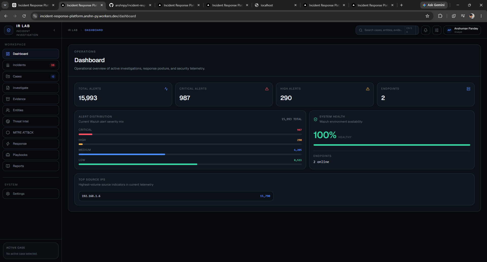
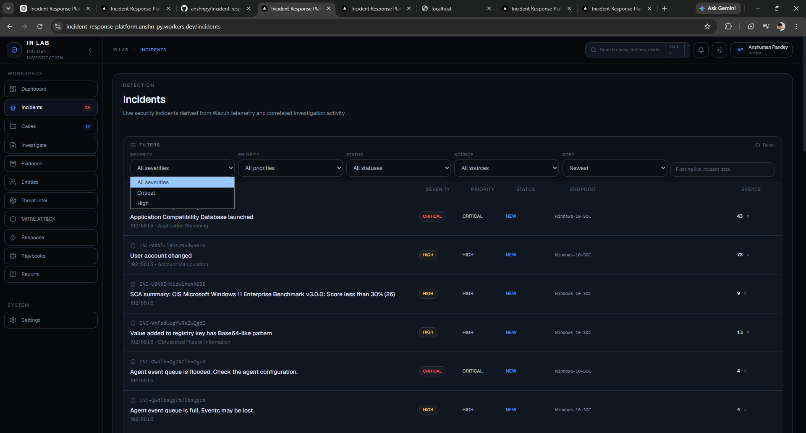
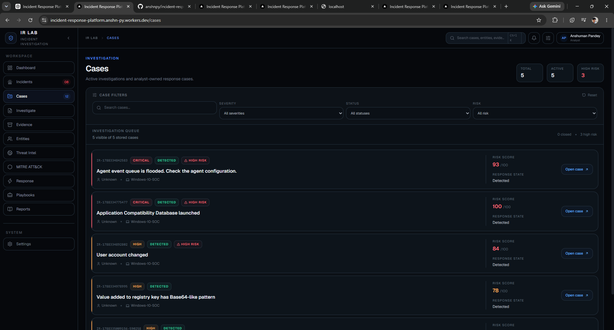
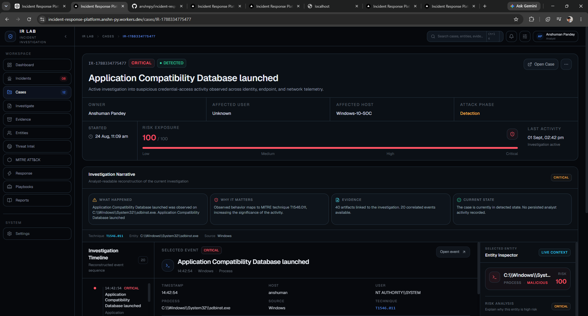
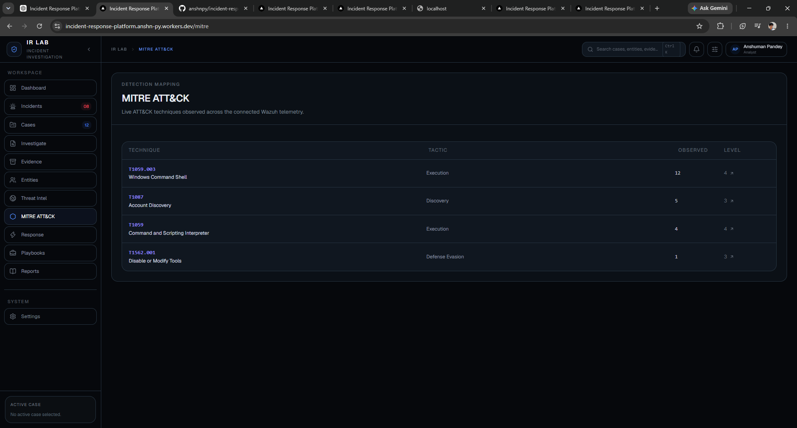
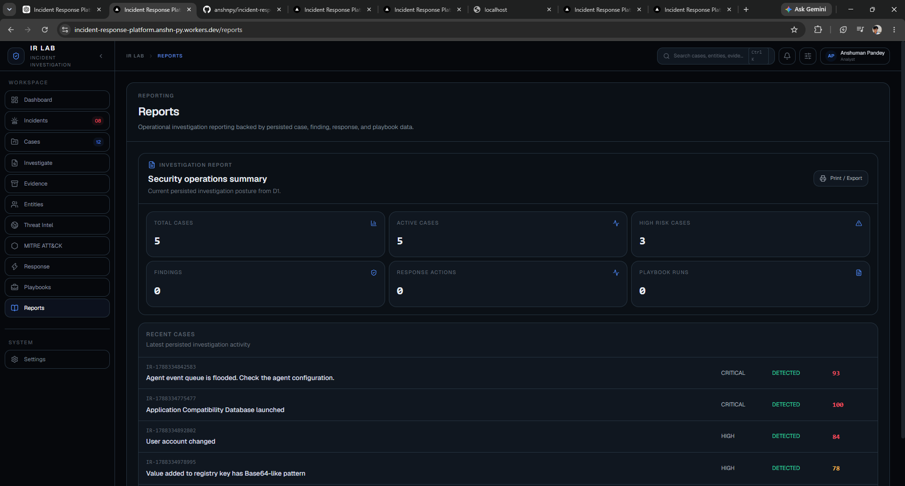

# Incident Response Platform

A production-ready SOC incident response workspace built around live **Wazuh security telemetry**, **Cloudflare Workers**, and **Cloudflare D1**.

## Overview

This platform takes a security analyst from **detection -> investigation -> response -> reporting** in one unified workspace.

- Live Wazuh incidents and alerts
- Analyst-owned investigation cases
- Entity and evidence investigation
- MITRE ATT&CK mapping
- Findings and response actions
- Threat intelligence views
- Playbook execution
- Operational reports
- Global search
- Cloudflare D1 persistence

## SOC Workflow

`	ext
Wazuh Telemetry
      |
Incident Detection
      |
Case Creation
      |
Investigation
      |
Evidence + Entities + MITRE
      |
Findings
      |
Response / Playbooks
      |
Operational Reports
``r

## Screenshots

### SOC Dashboard

### Live Wazuh Incidents

### Investigation Cases

### Investigation Workspace

### MITRE ATT&CK

### Operational Reports

## Key Features

### Live Incident Detection
Security events are consumed from Wazuh and presented with severity, occurrences, affected endpoints, sources, and ATT&CK context.

### Case Management
Cases persist in Cloudflare D1 with severity, status, risk score, owner, affected assets, source incident references, and case activity.

### Investigation Workspace
A structured analyst workspace for timeline review, evidence inspection, entities, findings, audit trail, and response actions.

### MITRE ATT&CK
Observed security telemetry is mapped into a technique-oriented investigation view.

### Response & Playbooks
Case-scoped response actions and sequential playbook execution with persistent execution state.

### Reporting
Operational reports aggregate investigation, case, findings, and response information.

## Tech Stack

- Next.js
- React
- TypeScript
- Tailwind CSS
- Motion
- Lucide React
- Cloudflare Workers
- Cloudflare D1
- OpenNext
- Wazuh

## Development

`ash
npm install
npm run dev
` 

Cloudflare development with remote resources:

`ash
npx wrangler dev
` 

## Production

Deployed on Cloudflare Workers with Cloudflare D1 persistence, Wazuh telemetry integration, and Cloudflare VPC service binding.

## Security Notes

Designed for controlled SOC, cybersecurity lab, and demonstration environments. Keep credentials and secrets outside source control.

## Author

**Anshuman Pandey**

Cybersecurity | SOC | Incident Response | Threat Detection
